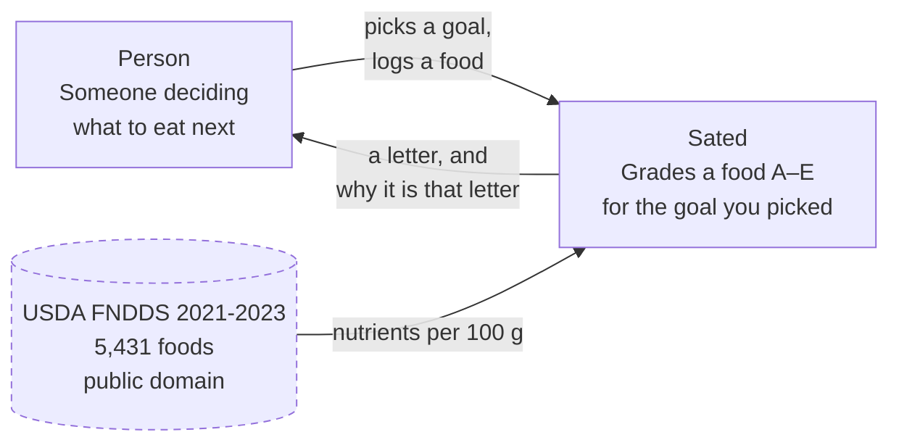
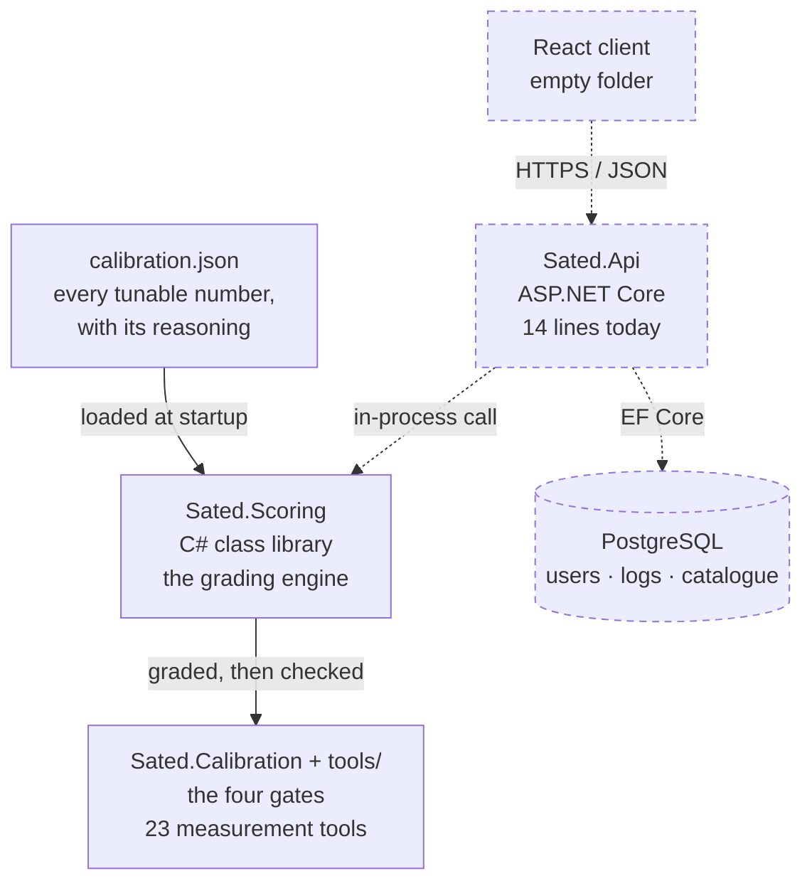
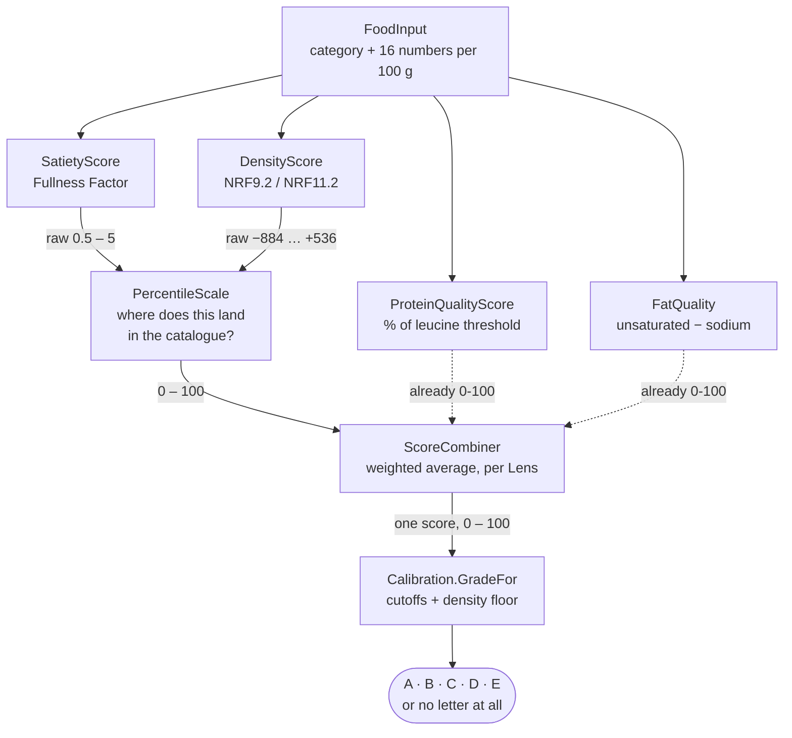
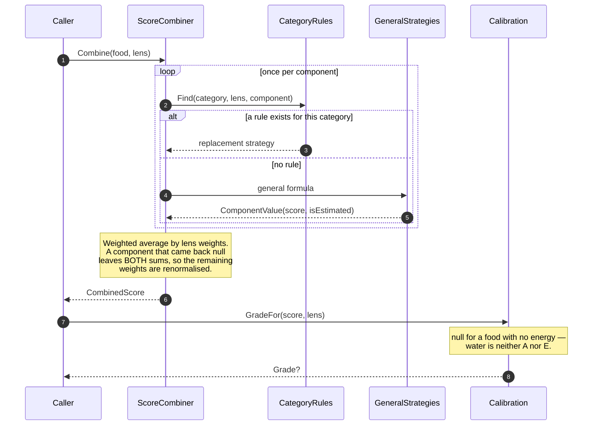

# Architecture

This page uses the [C4 model](https://c4model.com): four levels of zoom, from the system in its
world down to the code. Each level is a separate diagram, and a level is allowed to be mostly
empty — **today only level 3 is filled in**, because only the scoring engine exists. Epic 2 fills
in level 2. It does not redraw level 1.

Diagrams are [Mermaid](https://mermaid.js.org) source in this repository. They live in the diff,
they get reviewed like code, and they cannot go stale without somebody noticing.

---

## Level 1 — System context

Who talks to Sated, and what Sated talks to. Nothing about how it is built.

The interesting thing here is what is **absent**: Sated has no relationship with a food
manufacturer, a certifier, or a lab. Every number it uses is public. That is deliberate, and it is
why the formulas are not the defensible part of the product — see
[What is not a moat](#what-is-not-a-moat) below.

---

## Level 2 — Containers

The deployable and runnable pieces. **Solid boxes exist. Dashed ones do not yet.**

The engine deliberately **knows nothing about HTTP, users, or storage**. It is a pure library: you
hand it a food and a lens, it hands you back a score. That is what makes 152 tests possible without
a database, and it is what will let the API layer be thin when it arrives.

---

## Level 3 — Components inside the engine

The only level that is currently complete. This is the path a single food takes.

**The dashed arrows are the point.** Satiety and density produce raw numbers that mean nothing on
their own — a density of 240 is only good or bad relative to other foods, so both are ranked
against a measured catalogue distribution first. Protein quality and fat quality arrive as
percentages already, so they skip the scale entirely.

Getting this wrong is not a style question. Normalising a score against a distribution it was never
computed with grades every food against a formula that was never applied to it, silently.

---

## The call sequence

Level 3 shows where data goes. This shows *who calls whom*, including the part that is easy to miss:
a category rule replaces how a component is computed, but never sets the grade.

Two invariants this diagram encodes, both of which cost real bugs to learn:

1. **A rule replaces a component; it never removes one, and never assigns a letter.** A category
   cannot be handed its grade by decree, because then the grade stops being a measurement.
2. **A missing component leaves both the numerator and the denominator.** Treating "missing" as
   zero would grade a food on data nobody has.

---

## What is not a moat

The formulas are public and reproducible by any competent developer:

| Component | Source |
|---|---|
| Satiety | Fullness Factor, patent US 7,620,531 B1 (CondeNet, 2005). Not peer-reviewed. |
| Density | NRF9.2 — Drewnowski, 2009 |
| Protein quality | The 2.5–3 g per-meal leucine threshold, published literature |
| Catalogue | USDA FNDDS 2021-2023, public domain |

What is not reproducible in an afternoon is the **measurement**: 16,293 grades walked by an audit,
a benchmark split into a fitting set and a held-out set, and a frozen letter scale that does not
move when the catalogue grows. That is documented under [Decisions](../decisions/index.md) and
[The four gates](the-four-gates.md).
