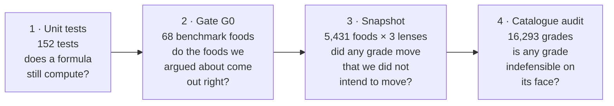

# The four gates

"Done" is not a feeling about the code. It is four commands that exit green.

```bash
dotnet test server/Sated.slnx && (cd server/Sated.Calibration && dotnet run) && (cd tools/CatalogueSnapshotQuery && dotnet run) && (cd tools/CatalogueAuditQuery && dotnet run)
```

Each gate catches something the others structurally cannot.



## Why four and not one

**Tests check the parts.** A test knows that `SatietyScore.Calculate` returns 3.3 for chicken
breast. It has no opinion about whether 3.3 is a sensible thing to believe about chicken.

**G0 checks the foods we have an opinion about.** 60 benchmark foods with required grades, 8 traps,
and 7 ordering pairs. The benchmark is *split*: the 60 are the fitting set, the traps and pairs are
held out and never consulted while choosing weights. That is what makes G0 a measurement rather
than a fit.

**The snapshot checks that nothing else moved.** A change aimed at olive oil that quietly moves
400 other foods is a regression, and no test names those 400 foods.

**The audit checks that no grade is absurd.** Four criteria, run over every one of the 16,293
grades the product can display. First run: **877 indefensible grades. Today: 0.**

## What the audit catches that nothing else does

The audit is the only gate that compares foods against *each other*. It found, among others:

- 89 foods with no energy at all spread across four letters and 77.7 points — diet Kool-Aid at A,
  Powerade Zero at E. Every score in this engine is a quantity per calorie, so for water the
  question was never asked. Those foods now get **no letter**, which is not a bad grade.
- Sugar-water drinks graded 49.4 and 4.5 for carrying **the same 34 kcal**, because the rule that
  zeroed their satiety was attached to three category *names* out of eleven.
- 725 pairs where a food better on every nutrient the engine reads scored lower, because fat
  quality was a switch: inside a listed category you got one formula, outside it another.

## What none of the four can prove

That the formulas are **true**. Nobody can demonstrate that, and the docs must not imply it. The
safe statement, and the one to use in public:

> No grade out of the 16,293 the product can show violates any of the four audit criteria. The
> catalogue is finite, and all of it was walked.

Independent external validation is currently **one study**: Holt 1995, 21 foods, Spearman 0.853 —
and it covers satiety only. Density and protein quality have no equivalent yet. Named candidates:
DIAAS for protein, convergence with Nutri-Score for density.

## Order matters when the engine changes

If you change anything that moves scores, the gates must be run in this order — see
[How to change the engine safely](../how-to/change-the-engine-safely.md).
