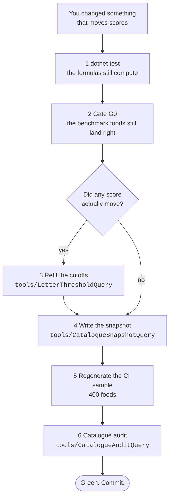

# How to change the engine safely

Any change that moves scores must run the gates **in this order**. Skipping step 3 is the mistake
that costs a whole afternoon: the letter cutoffs are the catalogue's own p20/p40/p60/p80, so if the
scores moved and the cutoffs did not, the grid is grading the catalogue against a distribution that
no longer exists.

## Why refitting is not cheating

A grade must not change because *other foods* joined or moved. That is what freezing the letter
scale protects. But the cutoffs are defined as percentiles **of the catalogue's own score
distribution** — so when a change moves every score, the old cutoffs describe a distribution that
no longer exists, and leaving them in place is the thing that produces arbitrary letters.

The rule that separates the two cases: **refit when the formula changed; never refit because you
did not like a letter.**

There is a precedent for *not* refitting, and it is instructive. When the calorie floor changed the
density formula, scores moved 0.09 on average and 0.30 at most, and exactly one letter changed.
Refitting there would have moved every food's letter for a reason that was not the food.

## Three generated files are built locally, not in CI

The catalogue is 63 MB and is not in the repository.

| File | Size | In git? |
|---|---|---|
| `catalogue-grades.csv` | 348 KB | yes |
| `typical-portions.csv` | 304 KB | yes |
| `catalogue-sample.csv` (400 foods) | small | yes — this is what CI tests against |

## When `FoodInput` gains a field

Three things must be updated together, or the change fails silently somewhere far away:

1. `AnyFood` — so generated property tests produce the field
2. `catalogue-sample.csv` — so the CI sample carries it
3. Every tool that builds a `FoodInput` from FNDDS

Give the new parameter **no default value** if the engine must never see it absent. The compiler
then names every caller that forgot. See
[What a food is to the engine](../explanation/what-a-food-is.md#optional-value-versus-optional-argument)
for why that distinction matters — it is the exact shape of a bug that graded a whole lens wrong in
silence.
